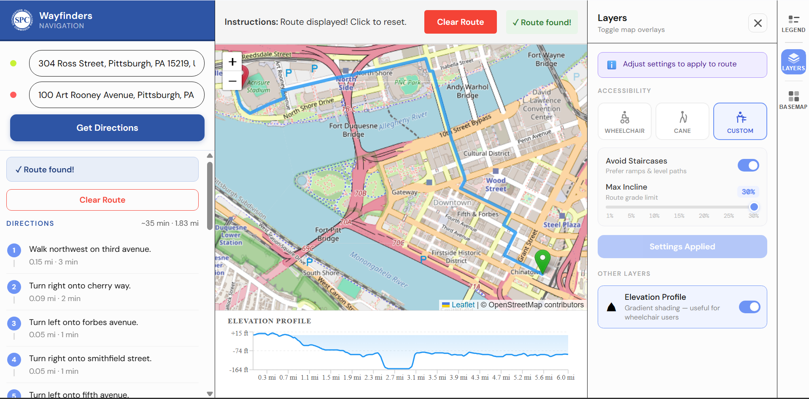

# SPC Wayfinding

> An accessibility-focused sidewalk routing application for Southwestern Pennsylvania, built on real sidewalk data from the [Southwestern Pennsylvania Commission](https://www.spcregion.org) (SPC).



**[See Installation Instructions](#getting-started)**
--

## Overview

SPC Wayfinding helps users navigate sidewalks and pedestrian infrastructure focused on the Southwestern Pennsylvania region. Unlike general-purpose mapping tools, this application integrates SPC's own sidewalk network data and supports **accessibility routing profiles** allowing users to find routes that account for mobility needs.

The application primarily covers the geographic bounding box of the SPC region(Allegheny, Armstrong, Beaver, Butler, Fayette, Greene, Indiana, Lawrence, Washington and Westmoreland Counties, as well as the City of Pittsburgh.)

- **Longitude:** -80.52° to -78.80°
- **Latitude:** 39.72° to 41.15°

---

## Architecture

The app is composed of **four Docker services** that start up in a specific order:

```
Browser (port 5173)
      │
      ▼
  frontend          – Vite/Node.js frontend
      │
      ▼
    api             – Python/FastAPI backend (port 8000)
      │         │
      ▼         ▼
  valhalla    postgres
  routing     database
  engine      (port 5432)
 (port 8002)
```


| Service    | Image / Build                  | Port   | Role                                                                                                            |
| ---------- | ------------------------------ | ------ | --------------------------------------------------------------------------------------------------------------- |
| `frontend` | `node:22-alpine`               | `5173` | Vite-based frontend UI served to the browser                                                                    |
| `api`      | Custom (`Dockerfile`)          | `8000` | FastAPI backend — handles routing requests, logging, and business logic                                         |
| `valhalla` | Custom (`Dockerfile.valhalla`) | `8002` | [Valhalla](https://github.com/valhalla/valhalla) routing engine — computes pedestrian paths from OSM + SPC data |
| `postgres` | `postgres:16`                  | `5432` | PostgreSQL database for logging and persistent data                                                             |


### Startup Order

Docker Compose enforces a strict startup sequence to ensure each service is ready before the next one depends on it:

1. `**valhalla**` starts first and bootstraps the routing tile data
2. `**postgres**` starts after Valhalla and waits until it passes a health check
3. `**api**` starts only after both Postgres and Valhalla are healthy
4. `**frontend**` starts last, once the API is healthy

---

## API Reference

The full interactive API docs (Swagger UI) are available at **[http://localhost:8000/docs](http://localhost:8000/docs)** once the app is running.

### `POST /valhalla/route`

Computes a pedestrian route between two coordinates. All routing requests are logged to the Postgres database.

**Request body:**

```json
{
  "locations": [
    { "lat": 40.4406, "lon": -79.9959 },
    { "lat": 40.4450, "lon": -79.9900 }
  ],
  "costing": "pedestrian",
  "directions_options": {
    "units": "miles"
  },
  "shape_format": "geojson",
  "elevation_interval": 30,
  "user_id": "optional-user-identifier"
}
```


| Field | Type | Description |
|---|---|---|
| `locations` | array | Required. Exactly two points: `[origin, destination]` |
| `costing` | string | Routing profile. Defaults to `"pedestrian"` |
| `directions_options.units` | string | `"miles"` or `"kilometers"` |
| `costing_options.pedestrian.incline` | int | Maximum uphill grade (%) to allow. Values of 0 or 30 (the slider ceiling) disable the constraint entirely |
| `costing_options.pedestrian.use_stairs` | float | Stair preference. `0.0` avoids stairs, `1.0` prefers them |
| `exclude_locations` | array | Coordinates to avoid during routing |
| `shape_format` | string | Format for the returned path geometry (e.g. `"geojson"`) |
| `elevation_interval` | int | Interval in meters at which to sample elevation along the route |
| `user_id` | string | Optional identifier logged with the request for analytics |  |


---

### `GET /geocode/autocomplete`

Returns address suggestions for a partial search string. Powered by Geoapify.


| Query param | Type   | Description                             |
| ----------- | ------ | --------------------------------------- |
| `q`         | string | Partial address or place name to search |


**Example:** `GET /geocode/autocomplete?q=Forbes+Ave+Pittsburgh`

---

### `GET /geocode/reverse`

Returns a human-readable address for a given coordinate pair.


| Query param | Type  | Description |
| ----------- | ----- | ----------- |
| `lat`       | float | Latitude    |
| `lon`       | float | Longitude   |


**Example:** `GET /geocode/reverse?lat=40.4406&lon=-79.9959`

---

## Admin Panel

A built-in browser UI for network management and demand analytics is available at **http://localhost:5173/admin**.

See **[ADMIN.md](./ADMIN.md)** for full documentation of each tab.

---

## Valhalla Bootstrap Process

When the `valhalla` container starts, `bootstrap_tiles.sh` runs automatically and does the following:

1. **Builds routing tiles** — runs `scripts/bootstrap_tiles.py` to process SPC sidewalk and OSM data into Valhalla's internal tile format. Pass `REBUILD_TILES=true` to force a full rebuild from scratch.
2. **Downloads elevation data** — fetches SRTM elevation tiles for the SPC bounding box using `valhalla_build_elevation`. Elevation data is cached in `./data/valhalla/elevation_data/` and skipped on subsequent starts if already present.
3. **Starts the routing service** — launches `valhalla_service` to begin serving routing requests on port 8002.

> Steps 1 and 2 only run in full on the first startup. Subsequent starts skip cached data and reach a healthy state much faster.

---

## Prerequisites

- [Docker](https://www.docker.com/get-started) (v20+ recommended)
- [Docker Compose](https://docs.docker.com/compose/install/) (v2+)
- Approximately **2 GB of free disk space** (routing tile data for the SPC region is large)
- A **Geoapify API key** (used for geocoding — converting addresses to coordinates)

---

## Environment Variables

Create a `.env` file in the project root before running. The following variables are required:

```env
# API key for the Geoapify geocoding service
GEOAPIFY_API_KEY=your_geoapify_key_here

# Secret key for admin-protected API endpoints
ADMIN_API_KEY=your_admin_key_here

# Set to "true" to force Valhalla to rebuild routing tiles from scratch
# Only needed if you update the underlying map/sidewalk data
REBUILD_TILES=false
```

> Never commit your `.env` file to version control. Add it to `.gitignore`.

---

## Getting Started

### 1. Clone the repository

```bash
git clone https://github.com/YOUR_USERNAME/wayfinding.git
cd wayfinding
```

### 2. Set up environment variables

```bash
cp .env.example .env
# Edit .env and fill in your API keys
```

### 3. Build and start all services

```bash
docker-compose up -d --build
```

This single command will:

- Build the `api` and `valhalla` Docker images from the local Dockerfiles
- Pull the `postgres` and `node` base images
- Run `bootstrap_tiles.sh` inside the Valhalla container to download and process OSM + SPC sidewalk data into routing tiles
- Start all four services in the correct order in the background

>   **The first build takes a while.** Valhalla has up to a 10-minute startup window (`start_period: 600s`) to finish processing map tiles before it is considered healthy. Subsequent starts are much faster since tiles are cached in `./data/valhalla`.

>   **If you are developing on Windows**, ensure that your Wayfinding\scripts\bootstrap_tiles.sh script is saved with LF line endings rather than CRLF(Go to the file and click CRLF in bottom right and switch to LF). Docker runs a Linux environment that cannot interpret Windows-style line endings which are automatically appended during Git download.

### 4. Verify all services are running

```bash
docker-compose ps
```

All four services should show a status of `Up` (or `Up (healthy)` once health checks pass).

You can also check individual service health:

```bash
# Valhalla routing engine
curl http://localhost:8002/status

# API backend
curl http://localhost:8000/valhalla/health
```

### 5. Open the app

Navigate to **[http://localhost:5173](http://localhost:5173)** in your browser.

---

## Useful Commands

```bash
# Start services without rebuilding images
docker-compose up -d

# View live logs from all services
docker-compose logs -f

# View logs for a specific service
docker-compose logs -f api

# Stop all services
docker-compose down

# Stop all services and delete the database volume (full reset)
docker-compose down -v

# Force Valhalla to rebuild routing tiles
REBUILD_TILES=true docker-compose up -d
```

---

## Data & Tile Caching

Valhalla routing tiles are stored in `./data/valhalla/` on your host machine (mounted as a Docker volume). This means:

- Tiles persist across container restarts — you won't need to reprocess them every time
- To update the routing data (e.g., after new SPC sidewalk data is available), set `REBUILD_TILES=true` and restart

---

## Tech Stack


| Layer               | Technology                                                                                                                |
| ------------------- | ------------------------------------------------------------------------------------------------------------------------- |
| Frontend            | Node.js 22, Vite                                                                                                          |
| Backend API         | Python 3.11+, FastAPI, Uvicorn                                                                                            |
| Routing Engine      | [Valhalla](https://github.com/valhalla/valhalla) (via [gis-ops Docker image](https://github.com/gis-ops/docker-valhalla)) |
| Map Data Processing | [osmium-tool](https://osmcode.org/osmium-tool/), GDAL, pyosmium                                                           |
| Database            | PostgreSQL 16                                                                                                             |
| Geocoding           | [Geoapify](https://www.geoapify.com/)                                                                                     |
| Containerization    | Docker, Docker Compose                                                                                                    |


---

## Contributing

Pull requests are welcome. For major changes, please open an issue first to discuss what you would like to change.

---

## License

Vahalla engine is licensed under MIT. Source code is from [https://github.com/valhalla/valhalla](https://github.com/valhalla/valhalla).
The rest of this project is licensed under GNU GPL v.3. 

---

## Acknowledgments

- [Southwestern Pennsylvania Commission (SPC)](https://www.spcregion.org/) for sidewalk network data
- [Valhalla](https://github.com/valhalla/valhalla) open-source routing engine
- [OpenStreetMap](https://www.openstreetmap.org/) contributors

